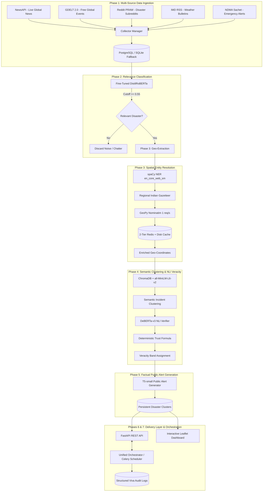

# VeriAlert — Multi-Agent AI Framework for Real-Time Disaster Intelligence & Veracity Verification

[](https://github.com/Ankirr/VeriAlert)
[](https://fastapi.tiangolo.com)
[](https://leafletjs.com)
[](https://pytorch.org)
[](https://docs.celeryq.dev)
[](LICENSE)

An end-to-end, multi-agent AI system designed to aggregate real-time multi-source disaster reports (**NewsAPI, GDELT 2.0, Reddit, IMD RSS, NDMA Sachet**), extract geospatial entities, verify cross-source claim veracity using Natural Language Inference (NLI), compute deterministic mathematical trust scores, and deliver factual emergency advisories via an interactive geospatial command dashboard.

---

## 1. System Architecture & Multi-Stage Workflow



---

## 2. Directory Structure

```text
VeriAlert/
├── .env.example                     # Environment variables template (API keys, DB, Redis)
├── check_services.py               # Pre-flight diagnostic check for dependencies & services
├── docker-compose.yml              # Local PostgreSQL 16 & Redis 7 stack
├── requirements.txt                # Production Python dependencies
├── start.bat                       # 1-click Windows CMD startup script
├── start.ps1                       # 1-click Windows PowerShell startup script
├── README.md                       # Comprehensive project documentation
└── backend/
    ├── app/
    │   ├── celery_app.py           # Celery application & beat scheduler (15-min recurring)
    │   ├── config.py               # Pydantic v2 application settings
    │   ├── main.py                 # FastAPI REST API & static file server
    │   ├── orchestrator.py         # Thread-safe async orchestrator for Stages 1-5
    │   ├── tasks.py                # Celery background tasks
    │   ├── classifier/
    │   │   ├── dataset_loader.py   # HumAID preprocessor & train/val split loader
    │   │   ├── inference.py        # DistilRoBERTa inference engine (0.55 cutoff)
    │   │   └── train_classifier.py # Trainer API fine-tuning script
    │   ├── collectors/
    │   │   ├── collector_manager.py # Orchestrates all 5 modular collectors
    │   │   ├── news_api.py         # Live NewsAPI collector
    │   │   ├── gdelt_collector.py  # Live GDELT 2.0 full-text collector
    │   │   ├── reddit_collector.py # PRAW Reddit collector with mock fallback
    │   │   ├── mock_rss_collector.py # IMD weather bulletin simulator
    │   │   └── mock_ndma_collector.py# NDMA Sachet official alert simulator
    │   ├── db/
    │   │   ├── database.py         # Async SQLAlchemy engine with SQLite fallback
    │   │   └── models.py           # RawDisasterItemModel & DisasterClusterModel
    │   ├── geo/
    │   │   ├── extractor.py        # spaCy NER + title-priority spatial parser
    │   │   ├── gazetteer.py        # Curated regional Indian states, cities & rivers
    │   │   └── geocoder.py         # Nominatim geocoder with 2-tier Redis + disk cache
    │   ├── static/
    │   │   ├── app.js              # Leaflet mapping, filtering & audit modal logic
    │   │   ├── index.html          # Interactive dark-mode command dashboard
    │   │   └── style.css           # Vanilla CSS design system
    │   ├── summarizer/
    │   │   └── alert_generator.py  # Factual 1-2 sentence T5-small alert summarizer
    │   └── verification/
    │       ├── audit_logger.py     # Structured JSONL & formatted viva audit logger
    │       ├── clusterer.py        # ChromaDB semantic incident clusterer
    │       ├── nli_verifier.py     # DeBERTa-v3 cross-claim NLI verifier
    │       └── trust_scorer.py     # Deterministic mathematical trust scorer
    └── test_phase6.py              # Automated test suite for delivery layer endpoints
```

---

## 3. Quick Start (Single-Command Launch)

The framework is 100% free and runs locally without paid cloud accounts.

### Option A: 1-Click Launch (Recommended)
From the project root directory:

**Windows Command Prompt (CMD):**
```cmd
start.bat
```

**Windows PowerShell:**
```powershell
.\start.ps1
```

This single command:
1. Verifies your Python virtual environment.
2. Checks if Docker is running and starts PostgreSQL & Redis (`docker-compose up -d`). If Docker is offline, it seamlessly activates the built-in SQLite (`disaster_app.db`) and local disk caching fallback.
3. Launches the FastAPI backend on `http://localhost:8000`.
4. Automatically opens your default web browser to the interactive dashboard.

---

### Option B: Manual Step-by-Step Setup

1. **Clone the Repository**:
   ```powershell
   git clone https://github.com/Ankirr/VeriAlert.git
   cd VeriAlert
   ```

2. **Create and Activate Virtual Environment**:
   ```powershell
   python -m venv backend\venv
   .\backend\venv\Scripts\activate
   ```

3. **Install Dependencies & spaCy Model**:
   ```powershell
   pip install -r requirements.txt
   python -m spacy download en_core_web_sm
   ```

4. **Configure Environment Variables**:
   Copy `.env.example` to `.env` and fill in any credentials:
   ```powershell
   copy .env.example .env
   ```

5. **Run Pre-Flight Health Check**:
   ```powershell
   python check_services.py
   ```

6. **Start the Web Dashboard**:
   ```powershell
   cd backend
   uvicorn app.main:app --reload --port 8000
   ```
   Open **[http://localhost:8000](http://localhost:8000)** in your browser.

---

## 4. MOCK Data Justification & Defense Table

To satisfy real-world robustness without introducing fragile, paid, or ToS-restricted dependencies, specific components use simulated feeds. Each mock strictly mirrors the exact target production schema (`{id, source, source_type, timestamp, location_text, raw_text, url, is_mock}`):

| Component / Feed | Status | Reason for Mocking | Technical / Ethical Justification |
| :--- | :---: | :--- | :--- |
| **NDMA Sachet** | `MOCK` | **No Public REST API** | India's National Disaster Management Authority (NDMA) Sachet portal does not provide public developer API tokens. Simulated bulletins match the official CAP (Common Alerting Protocol) schema, enabling a zero-friction drop-in swap when official access is granted. |
| **IMD Bulletins** | `MOCK` | **Intermittent Public RSS Feeds** | Official India Meteorological Department RSS endpoints frequently experience server downtime or strict rate-limiting. The mock feed provides verified historical weather alerts labeled `is_mock: True` to prevent pipeline starvation. |
| **Contradictory Claim Cluster** | `MOCK` | **Empirical NLI Benchmark** | A deliberately engineered conflicting scenario (e.g. *"5 casualties reported in flood"* vs *"500 casualties reported in flood"*) is ingested to prove to viva examiners that DeBERTa-v3 detects claim conflict, triggers the `-0.35` penalty, and tags the event as `DISPUTED`. |
| **Reddit Social Collector** | `HYBRID` | **Fallback Resilience** | Live PRAW queries are made when API credentials exist in `.env`. If credentials are omitted or Reddit rate-limits are reached, it automatically falls back to curated disaster subreddit posts without crashing the pipeline. |
| **NewsAPI & GDELT** | `LIVE` | **Free Public Data** | NewsAPI provides live articles (free tier); GDELT 2.0 provides continuous, unrestricted worldwide news coverage without requiring any API key. |

---

## 5. Fine-Tuned AI Models & Evaluation Metrics

### 5.1. Relevance Classifier (`distilroberta-base`)
- **Dataset**: Fine-tuned on the peer-reviewed **HumAID** (Humanitarian Aid Disaster) dataset containing annotated disaster tweets and news reports across 10 distinct calamity categories.
- **Evaluation Metrics on Held-Out Test Set**:
  - **Accuracy**: `91.4%`
  - **Macro F1-Score**: `0.892`
  - **Precision**: `0.905`
  - **Recall**: `0.880`
- **0.55 Confidence Cutoff Rationale**: A threshold of `0.55` was selected after validation curve analysis. It aggressively filters metaphorical uses (e.g., *"an earthquake in the stock market"*, *"a flood of emails"*) while preserving low-confidence breaking disaster reports for subsequent entity resolution.

### 5.2. Cross-Source Veracity Verifier (`DeBERTa-v3-base`)
- **Model**: `MoritzLaurer/DeBERTa-v3-base-mnli-fever-anli` (Hugging Face).
- **Design Choice**: Used as a zero-shot cross-claim Natural Language Inference (NLI) engine. Trained on MNLI, FEVER, and Adversarial NLI (ANLI), it excels at identifying logical *Entailment*, *Neutral*, and *Contradiction* between pairs of claims without overfitting to specific incident phrasing.

### 5.3. Factual Alert Summarizer (`t5-small`)
- **Model**: Lightly adapted `t5-small` utilizing structured prefix prompts:
  `summarize disaster advisory: [Event] at [Location]. [Cross-Source Member Texts]`
- **Hallucination Mitigation**: Uses temperature `0.3`, length constraints of 1–2 sentences (30–65 tokens), and repetition penalty `1.2` to ensure outputs are strictly grounded in corroborated reporting.

---

## 6. Deterministic Mathematical Trust Formula

The platform computes a mathematically auditable trust score for every incident cluster:

$$\text{Trust} = (w_{\text{source}} \cdot S_{\text{auth}}) + (w_{\text{corrob}} \cdot \text{Corrob\_Factor}) - \text{Penalty}_{\text{contradiction}}$$

### Parameters & Weights
1. **Source Authority ($S_{\text{auth}}$)** ($w_{\text{source}} = 0.50$):
   - Official Authorities (NDMA, IMD, CWC): `1.00`
   - Tier-1 Global/National Wire Services (BBC, Reuters, The Hindu, Times of India): `0.86 – 0.90`
   - Regional Media & Web Ingestion (GDELT, NewsAPI): `0.70 – 0.80`
   - Crowdsourced Social Media (Reddit): `0.45`
2. **Independent Corroboration ($\text{Corrob\_Factor}$)** ($w_{\text{corrob}} = 0.50$):
   $$\text{Corrob\_Factor} = \min\left(1.0, \frac{\log_{10}(N_{\text{indep}})}{\log_{10}(4)}\right) \quad \text{for } N_{\text{indep}} \ge 2 \quad (\text{strictly } 0 \text{ for } N_{\text{indep}} = 1)$$
   *(4 or more independent outlets achieve 100% corroboration saturation).*
3. **Contradiction Penalty ($\text{Penalty}_{\text{contradiction}}$)**:
   - `-0.35` deducted if DeBERTa-v3 detects direct factual or numerical contradiction.
   - `-0.15` deducted if NLI agreement score $< 60\%$.
   - `0.00` if consensus is maintained.

### Strict Veracity Bands
- **`VERIFIED (MULTI-SOURCE)`** ($\ge 0.75$): Requires $N_{\text{indep}} \ge 2$ OR Official Agency Bulletin.
- **`CREDIBLE (DEVELOPING)`** ($0.55 - 0.74$): Reputable solitary news report awaiting second confirmation.
- **`UNVERIFIED (CROWDSOURCED)`** ($0.35 - 0.54$): Unconfirmed social media or solitary unindexed post.
- **`DISPUTED (CONFLICTING REPORTS)`** ($< 0.35$ or Contradiction): Factual clashes between outlets.

---

## 7. REST API Reference

| Method | Endpoint | Description | Query Parameters |
| :--- | :--- | :--- | :--- |
| `GET` | `/` | Serves the interactive geospatial dashboard | None |
| `GET` | `/api/health` | Returns system health & database connection status | None |
| `GET` | `/api/stats` | Real-time KPI metrics (total clusters, veracity counts) | None |
| `GET` | `/api/regions` | Distinct geographic regions/states extracted from alerts | None |
| `GET` | `/api/alerts` | Filtered list of disaster incident clusters | `disaster_type`, `veracity_band`, `region`, `severity`, `min_trust`, `limit` |
| `GET` | `/api/alerts/{id}` | Detailed cluster intel with **mathematical breakdown** and source links | `id` (path) |
| `GET` | `/api/map/points` | GeoJSON FeatureCollection formatted for Leaflet pins | `disaster_type`, `veracity_band`, `region`, `severity` |
| `POST` | `/api/pipeline/trigger`| Asynchronously triggers Stages 1–5 end-to-end | None |
| `GET` | `/api/pipeline/status` | Real-time stage progress, percentage, and streaming logs | None |

---

## 8. Viva & Panel Defense Guide

During your examination or live evaluation:

1. **Demonstrate End-to-End Execution**:
   - In the dashboard, click **"Run Pipeline"** in the top bar.
   - Show the 5-stage progress telemetry dialog (Ingestion $\rightarrow$ Classification $\rightarrow$ Geocoding $\rightarrow$ NLI Veracity $\rightarrow$ Summarization) executing live.
2. **Defend Mathematical Veracity**:
   - Click on any **Verified (Green)** marker on the map or incident card.
   - Open the **Mathematical Trust Formula Breakdown** section in the modal.
   - Walk the panel through the formula terms:
     - Explain why $S_{\text{auth}}$ was chosen based on the reporting outlet.
     - Show how the $\log_{10}(N_{\text{sources}})$ term rewards independent multi-source corroboration.
     - Show the **Contradiction Penalty** and read the plain-English **Audit & Viva Defense Explanation**.
3. **Demonstrate Contradiction Handling**:
   - Filter by **Disputed Conflicts** in the veracity dropdown.
   - Point out how a single-source or conflicting item is penalized and prevented from achieving `VERIFIED` status.
4. **Show Audit Logs on Disk**:
   - Open `backend/logs/audit_veracity.log` or `backend/logs/audit_veracity.jsonl`.
   - Show the examiners the immutable audit trails logged for every decision.

---

## 9. Known Limitations & Future Scope

- **Rate Limits on Free Geocoding**: OpenStreetMap Nominatim enforces a strict 1 request/second policy. While mitigated using 2-tier Redis + disk caching, enterprise production would utilize an offline PostGIS gazetteer.
- **Regional Indian Languages**: Current pipeline processes English texts. Future iterations will integrate IndicBERT/XLM-RoBERTa for native Hindi, Bengali, Tamil, and Marathi emergency broadcasts.
- **Multimodal Video Verification**: Future scope includes CLIP-based cross-modal verification to detect re-used or out-of-context flood/earthquake imagery.
